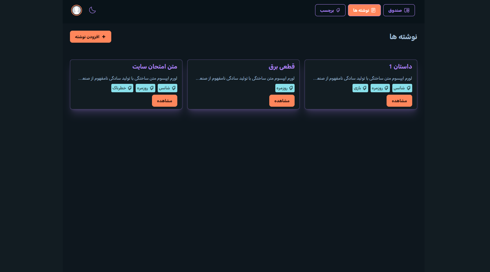

# Note Taking Application



## 🚀 Live Preview

👉 [Click here to view the live demo](https://note-app-cz0r.onrender.com/)

A Simple, feature-rich note-taking application built with React, TypeScript, and Zustand for state management. This application allows users to create, edit, and organize notes with tags, all stored locally in the browser.

## Project Overview

This note-taking application provides a clean and intuitive interface for managing personal notes. Users can create notes with titles and content, organize them with tags, and easily search or browse through their collection. All data is persisted locally in the browser, ensuring privacy and offline access.

Key features include:

- Create, read, update, and delete notes
- Tag organization system for better note categorization
- Responsive design that works on desktop and mobile devices
- Dark/light theme support
- Data persistence using browser storage

## Installation Instructions

To set up and run this application locally, follow these steps:

1. **Prerequisites**: Ensure you have Node.js (version 16 or higher) installed on your system.

2. **Clone the repository**:

    ```bash
    git clone <repository-url>
    cd note_app
    ```

3. **Install dependencies**:

    ```bash
    npm install
    ```

4. **Start the development server**:

    ```bash
    npm run dev
    ```

5. **Build for production** (optional):
    ```bash
    npm run build
    ```

The application will be available at `http://localhost:5173` (or another port if 5173 is occupied).

## Usage Guidelines

Once the application is running, you can:

1. **Create a new note**: Click on the "New Note" button to create a new note with a title, content, and optional tags.

2. **View notes**: All existing notes are displayed on the main page, sorted by the most recently updated.

3. **Edit notes**: Click on a note to view its details, then click the "Edit" button to modify its content.

4. **Manage tags**: Navigate to the Tags page to create new tags or delete existing ones.

5. **View notes by tag**: Filter notes based on their assigned tags (implementation may vary).

The application features a responsive design that works well on both desktop and mobile devices.

## Features

- **Note Management**: Create, view, edit, and delete notes with rich text content.
- **Tagging System**: Organize notes with tags for easier categorization and search.
- **Local Storage**: All data is stored locally in your browser, ensuring privacy and offline access.
- **Responsive Design**: Works seamlessly across desktop, tablet, and mobile devices.
- **Simple UI**: Clean, intuitive interface built with Tailwind CSS and DaisyUI components.
- **Type Safety**: Built with TypeScript for enhanced code reliability and developer experience.

## Technologies Used

- **React 19** with TypeScript for the frontend framework
- **Zustand** for state management
- **TanStack Router** for client-side routing
- **Tailwind CSS** with DaisyUI for styling
- **React Icons** for iconography
- **Vite** for build tooling and development server

## Contributing

Contributions are welcome! To contribute to this project:

1. Fork the repository
2. Create a new branch for your feature or bug fix
3. Make your changes and commit them with descriptive messages
4. Push your changes to your fork
5. Submit a pull request to the main repository

Please ensure your code follows the existing style and includes appropriate tests where applicable.

## Reporting Issues

If you encounter any bugs or have feature requests, please open an issue on the GitHub repository with:

- A clear and descriptive title
- Detailed steps to reproduce the issue (if applicable)
- Information about your environment (browser, operating system, etc.)

## License

This project is open source and available under the [MIT License](LICENSE).

## Contact/Support

For additional support or questions, please open an issue on the GitHub repository. For private inquiries, contact the repository owner directly.

The application is designed to be self-contained and does not require any external services or APIs to function.
